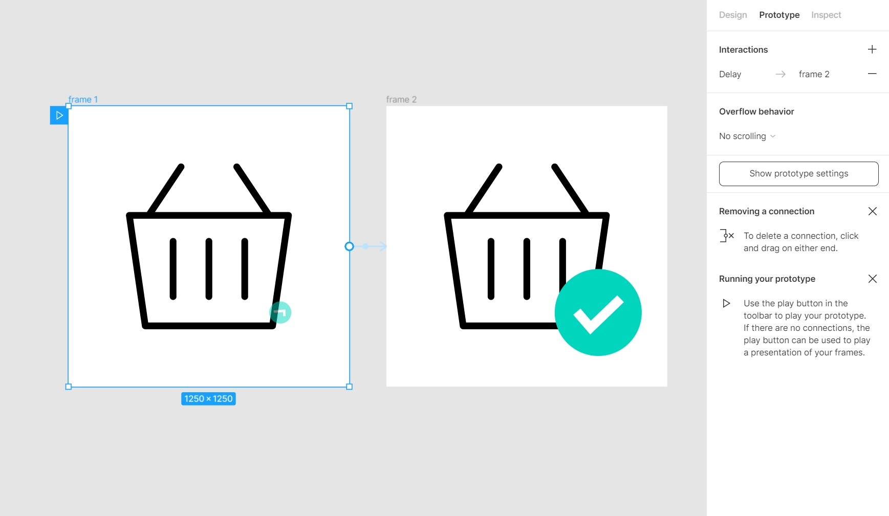
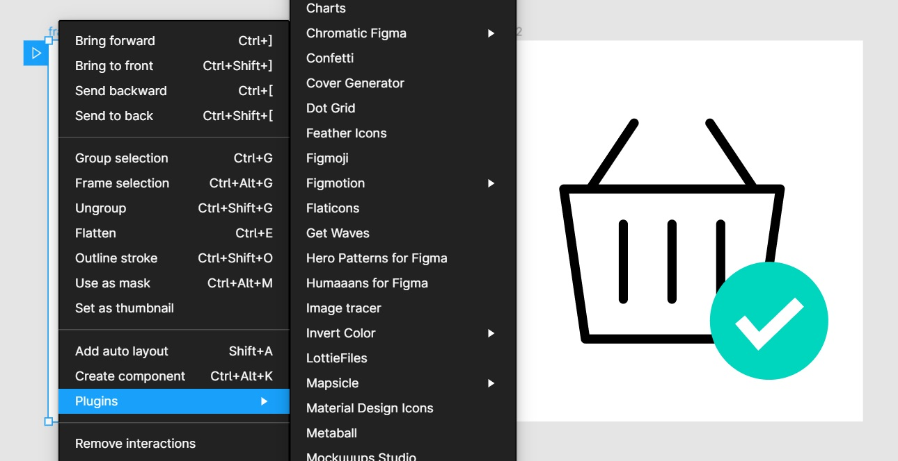

# Zest
Zest makes beautiful and performant CSS animations straight from Figma files.

## Installing

You can find Zest in the [Figma Community](https://www.figma.com/community/plugin/937773902534356458)

## Quickstart

Building an animation in Zest is easy.

### Step 1

Create a starting "frame" in Figma, then duplicate it for each keyframe in the animation.

### Step 2

Connect your frames using Figma's prototyping tools. Zest will end the animation after it loops or reaches a frame without any further interactions.

### Step 3

Right-click on the first frame of your animation and open the Zest plugin to generate the animation.

### Step 4

Zest will open up, with a preview of the animation, SVG markup and CSS animation ready-to-go.

## Supported Animation Features

Zest is in it's early days, it supports a handful of types of animation features including:

 - Opacity (for zero value, use 0.1%!)
 - Rectangle Scale & Position
 - Circle Scale & Position
 - Path Scale, Rotation and Position